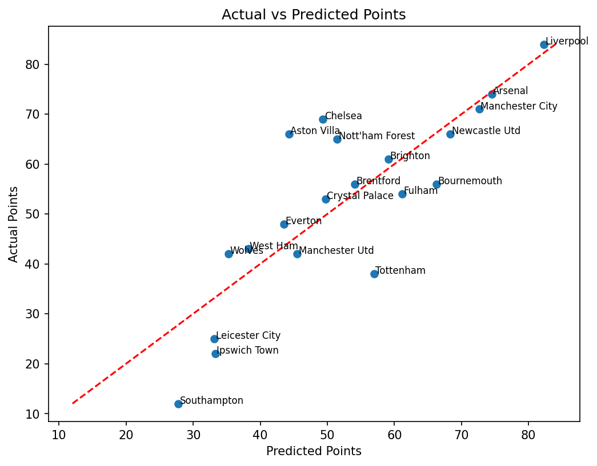

# Possession Football Project

## Introduction
Does possession matter? Over the course of a season, does having more possession translate into better results and more points? What is the relationship between possession and performance?  
This project explores the link between possession and success in the Premier League, looking at whether controlling the ball leads to better outcomes — and where the exceptions lie.

## Goals
- Check the relationship between possession and total points in the Premier League last season.
- Identify and plot exceptions to see:
  - Which teams followed the general trend of possession → points.
  - Which teams had high possession but fewer points than expected.
  - Which teams outperformed their possession levels in terms of points.
- Explore other indicators of passing that might better explain points over a season.
- Conduct basic statistical analysis (details in the notebook).
- Define the scope for further analysis in future iterations.

## Procedure & Analysis

### Step 1 — Visualizing the relationship
The first step was to simply plot average possession (%) against total points for each Premier League team last season.  
The goal here was not to jump straight to conclusions, but to get a **visual sense** of whether possession appears to translate into better results.

As you can see from the chart:
- **Manchester City** lie almost exactly on the trendline — their points total is exactly in line with what the possession trend would predict.
- **Liverpool**, however, **outperformed expectations**, earning more points than their possession would suggest.
- **Manchester United**, **Tottenham**, **Leicester City**, and **Ipswich Town** **underperformed** relative to the trend, earning fewer points than expected.
- **Nottingham Forest** completely broke the pattern, finishing with far more points than their possession would predict.

### Step 2 — Statistical check
To quantify the relationship between possession and points, I ran a simple **Ordinary Least Squares (OLS)** regression.

**Key results:**
- **R-squared:** ~0.27 → Possession explains about **27% of the variation** in points. This is a **weak-to-moderate** relationship.
- **Coefficient for Possession:** ~**+1.62** → Each additional 1% possession is associated with roughly **1.6 extra points** over a season.
- **p-value (for Possession):** ~0.02 → Statistically significant at the 5% level, meaning the relationship is unlikely to be due to random chance.
- **Intercept:** -28.66 → In theory, a team with 0% possession would score negative points (which obviously isn’t realistic — this is just a quirk of the model fit).

**Interpretation:**  
Possession does matter, but the majority of variation in points (about 73%) is explained by **other factors** — such as shot quality, finishing, defensive solidity, game state, and perhaps sheer chaos.

### Step 3 — Beyond possession: adding progressive passes

Possession tells us *who* had the ball, but not *what they did with it*.  
So the next step was to include **progressive passes (`PrgP`)** in the model — a metric that counts forward passes advancing the ball significantly towards the opponent’s goal.

The idea: see if we can improve our explanatory power (R²) by measuring attacking intent, not just ball control.

**Regression results (key points):**
- **R-squared:** 0.68 → a big jump from 0.27 earlier. This model explains about **68% of the variation** in points.
- **Coefficient for Progressive Passes:** ~+0.106 → Each extra progressive pass over the season is associated with about 0.1 additional points.
- **Coefficient for Possession:** ~–3.27 → Surprisingly negative!  
  This doesn’t mean possession is bad — rather, once progressive passes are accounted for, high possession *without progression* might reflect slower, less incisive play.
- **p-values:** Progressive passes (p < 0.001) are a very strong predictor; possession (p ≈ 0.011) is still statistically significant, but in the opposite direction.

**Takeaway:** Progressive passing is a much stronger explanatory factor than raw possession. Teams that keep the ball but fail to move it forward quickly may underperform compared to more direct teams.

### Step 4 — Predicted vs Actual Points

Here's a visual depiction of how the model predicted teams to finish and where they actually finished:

This chart plots the **predicted points** from our possession + progressive passes model against the **actual points** each team earned.  
The closer a team lies to the diagonal line, the more accurate the model’s prediction.

Compared to the simple possession chart earlier, this model does a much better job of explaining team performance — exactly as we expected after adding progressive passes.

- **Liverpool**: In the possession-only chart, Liverpool was far above the trendline; here, the model explains their points much better.  
- **Manchester United**: Similarly, now sits closer to the diagonal, suggesting the model captures more of their performance factors.  
- **Nottingham Forest**: Still an outlier, but much better explained than before.  
- **Chelsea**: Emerges as a positive outlier — they earned more points than their possession + progressive passes stats would predict.  
- **Tottenham**: A notable negative outlier — finished with fewer points than predicted.  
- **Leicester City, Southampton, and Ipswich Town**: Also underperformed, earning far fewer points than the model expected.

**Takeaway:** Incorporating progressive passes not only improved the statistical fit (R² from 0.27 → 0.68) but also made the model’s predictions align much more closely with reality for most teams.

### Step 5 — Adding attacking penalty area touches and shot-creating actions

We’re still chasing the question: *How much of a team’s points can be explained by what they do on the ball?*  

After possession and progressive passes, I suspected there was still room to improve the model’s predictive power.  
So I added two more attacking metrics:  

- **Touches in the attacking penalty area (`Att Pen`)**
- **Shot-creating actions (`SCA`)**

**Key results:**
- **R-squared:** ~0.85 → The model now explains about **85% of the variation** in points, a big jump from our earlier versions.
- **Attacking Penalty Area Touches:** Positive and statistically significant — each additional touch in this zone over the season correlates with higher points.
- **Shot-Creating Actions:** Positive coefficient, but not statistically significant at the 5% level in this sample.
- **Possession & Progressive Passes:** Both coefficients turned negative — a result of **multicollinearity**, where variables overlap and “compete” to explain the same part of the variation.  
  In other words, once we control for penalty area touches and SCAs, possession and progressive passes on their own no longer add unique explanatory power — and may even capture slower, less direct play in this context.

**Takeaway:** Combining possession with direct attacking actions gives us a much richer picture. While possession and progression metrics matter, the real points boost comes from getting the ball into dangerous areas and creating chances.

