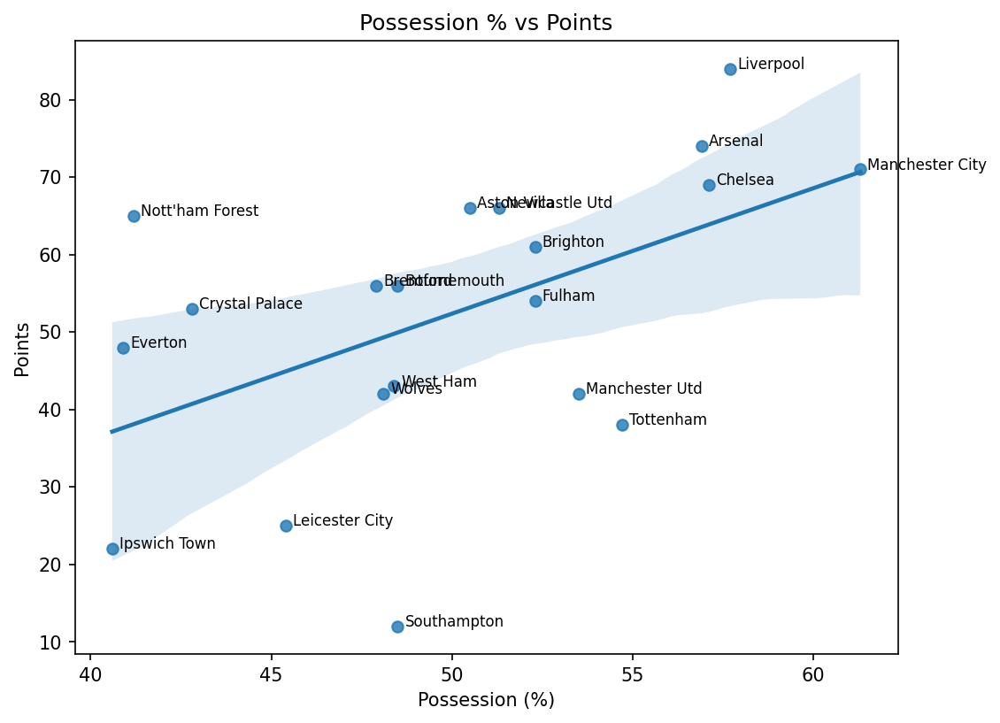

# Possession Football Project

## Introduction
Does possession matter? Over the course of a season, does having more possession translate into better results and more points? What is the relationship between possession and performance?  
This project explores the link between possession and success in the Premier League, looking at whether controlling the ball leads to better outcomes — and where the exceptions lie.

## Goals
- Check the relationship between possession and total points in the Premier League last season.
- Identify and plot exceptions to see:
  - Which teams followed the general trend of possession → points.
  - Which teams had high possession but fewer points than expected.
  - Which teams outperformed their possession levels in terms of points.
- Explore other indicators of passing that might better explain points over a season.
- Conduct basic statistical analysis (details in the notebook).
- Define the scope for further analysis in future iterations.

## Procedure & Analysis

### Step 1 — Visualizing the relationship
The first step was to simply plot average possession (%) against total points for each Premier League team last season.  
The goal here was not to jump straight to conclusions, but to get a **visual sense** of whether possession appears to translate into better results.

As you can see from the chart:
- **Manchester City** lie almost exactly on the trendline — their points total is exactly in line with what the possession trend would predict.
- **Liverpool**, however, **outperformed expectations**, earning more points than their possession would suggest.
- **Manchester United**, **Tottenham**, **Leicester City**, and **Ipswich Town** **underperformed** relative to the trend, earning fewer points than expected.
- **Nottingham Forest** completely broke the pattern, finishing with far more points than their possession would predict.

### Step 2 — Statistical check
To quantify the relationship between possession and points, I ran a simple **Ordinary Least Squares (OLS)** regression.

**Key results:**
- **R-squared:** ~0.27 → Possession explains about **27% of the variation** in points. This is a **weak-to-moderate** relationship.
- **Coefficient for Possession:** ~**+1.62** → Each additional 1% possession is associated with roughly **1.6 extra points** over a season.
- **p-value (for Possession):** ~0.02 → Statistically significant at the 5% level, meaning the relationship is unlikely to be due to random chance.
- **Intercept:** -28.66 → In theory, a team with 0% possession would score negative points (which obviously isn’t realistic — this is just a quirk of the model fit).

**Interpretation:**  
Possession does matter, but the majority of variation in points (about 73%) is explained by **other factors** — such as shot quality, finishing, defensive solidity, game state, and perhaps sheer chaos.

